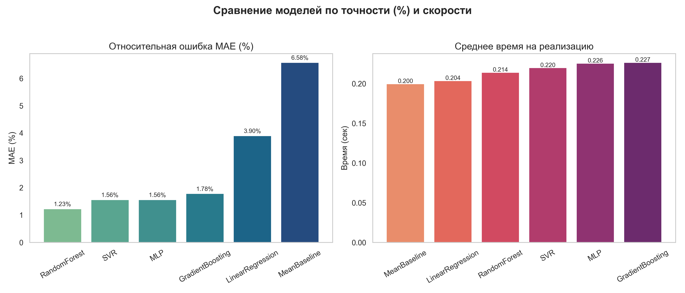
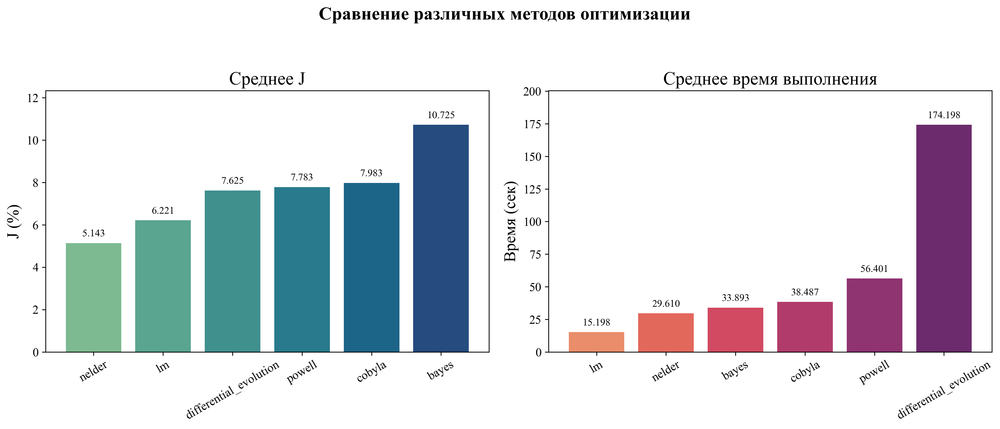
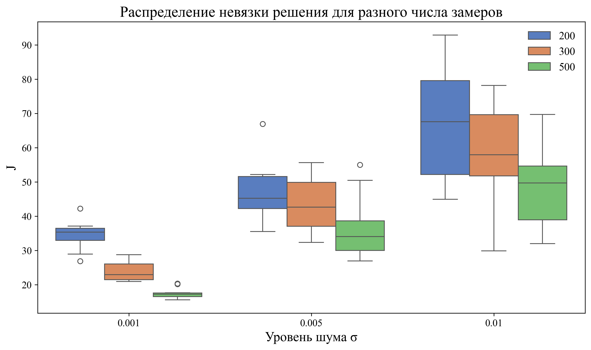
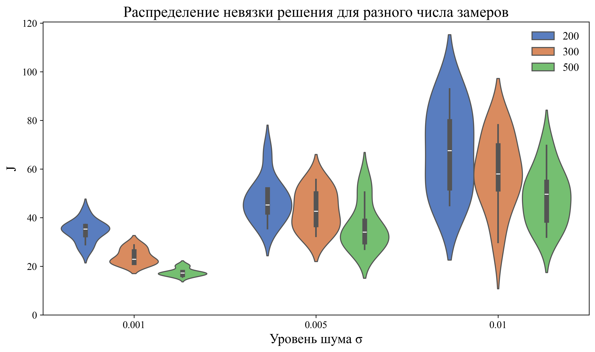
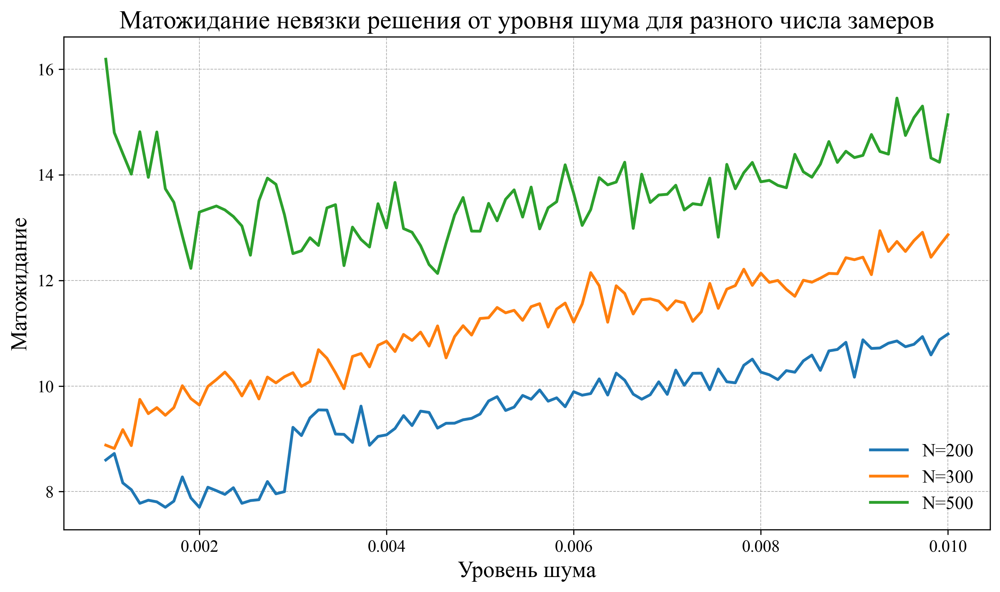
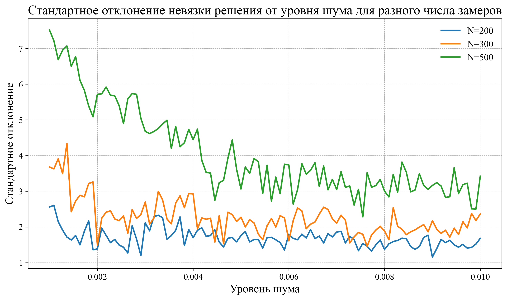
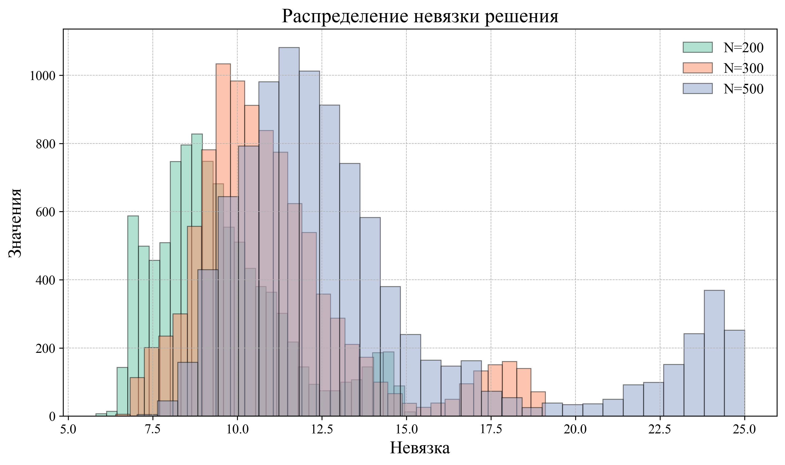
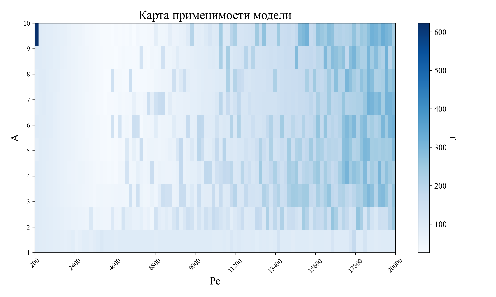

# Аналитическая модель для интерпретации термометрии нагнетательных скважин

## Описание проекта

Данный проект представляет собой разработку аналитической модели для интерпретации данных термометрии нагнетательных скважин, позволяющей находить интервалы утечек без необходимости остановки скважины. Модель основана на решении уравнения теплопроводности в стволе нагнетательной скважины и учитывает динамику теплопереноса в системе скважина-пласт.

Основной целью проекта является создание эффективного инструмента для анализа профилей утечек в скважинах по результатам анализа термометрии со скважины. Это достигается путем:

1.  **Разработки аналитического решения прямой задачи термометрии:** модель позволяет рассчитывать температурный профиль в скважине при известных параметрах пласта и режиме закачки.
2.  **Идентификация интервалов утечки:** написание алгоритма поиска точек роста функции.  
2.  **Решения обратной задачи термометрии:** использование аналитического приближения для определения неизвестных параметров пласта по измеренным температурным данным.
3.  **Реализации численных методов для решения обратной задачи:** применение различных методов оптимизации для нахождения оптимального набора параметров пласта, которые наилучшим образом соответствуют измеренным данным.
4.  **Проверка модели на тестовых данных:** использовался алгоритм зашумления замеров: к каждому замеру добавляется случайная величина, имеющая нормальный закон распределения 
$\xi \sim N(0, \sigma^2)$.
5.  **Оценки устойчивости и чувствительности модели:** исследование влияния погрешностей измерений и параметров модели на точность результатов.
6.  **Построения карты применимости модели:** определение границ применимости модели, основанных на различных параметрах пласта и условиях проведения измерений.
7.  **Проверка модели на реальных данных со скважины.**
8.  **Создание приложения для интерактивного анализа данных.**
## Методы и подходы

### 1. Аналитическое решение прямой задачи

Для описания температурного распределения в скважине используется аналитическое решение уравнения теплопроводности в цилиндрической системе координат в безразмерных переменных:
$$
\frac{\partial \theta}{\partial z} - \frac{1}{\mathrm{Pe}} \frac{\partial^2 \theta}{\partial z^2} = \frac{\mathrm{A}}{\mathrm{Pe}} \left( \theta_s - \theta \right), \quad
\mathrm{A} = \frac{\lambda_s}{\lambda_w} \frac{2}{r_w^2 \ln \left( \frac{r_s}{r_w} \right)}, \quad
\mathrm{Pe} = \frac{L v_0 \rho_w c_w}{\lambda_w}
$$
Учтены основные факторы, влияющие на теплоперенос, такие как:

*   Теплопроводность горных пород и теплоносителя.
*   Теплоемкость горных пород и теплоносителя.
*   Скорость закачки теплоносителя.
*   Температура нагнетания.

### 2. Идентификация интервалов утечки 
Для нахождения интервалов утечки был реализован алгоритм поиска точек роста зашумленной кривой с помощью скользящей оконной регрессии.
Анимация работы алгоритма:

В качестве мета-моделей были проверены основные модели машинного обучения. Метрикой качества было выбрано **относительное среднее абсолютное отклонение (Relative MAE) по найденным границам**:

$$
\text{Relative MAE} = \frac{1}{n} \sum_{i=1}^n \frac{|y_i - \hat{y}_i|}{y_{\text{max}} - y_{\text{min}}} \times 100\%
$$

**Где:**  
- $y_i$ — истинное значение границы.
- $\hat{y}_i$ — предсказанное моделью значение.
- $y_{\text{max}}$, $y_{\text{min}}$ — максимальное и минимальное значения в выборке.  
- $n$ — количество точек измерений.

Для набора обучающей выборки была использована библиотека optuna и байесовская оптимизация, значительно ускоряющие время расчета.

### 3. Численное решение обратной задачи

Обратная задача решалась путём минимизации функционала:
$$ 
E = \frac{1}{n} \sum_{j=1}^n \left( \langle \theta \rangle (z_j, \xi) - \langle \theta \rangle_j \right)^2 \rightarrow \underset{\xi}{\min} 
$$

Где:
- $\langle \theta \rangle_j$ — замеренные значения параметра $\theta$ в скважине для точки $z_j$,
- $\langle \theta \rangle (z_j, \xi)$ — модельные значения параметра $\theta$, рассчитанные для координаты $z_j$ с параметрами модели $\xi$,
- $\xi$ — набор калибруемых параметров модели,
- $n$ — количество точек измерений.

Для оценки точности модели в качестве метрики была использована удельная площадь отклонения профиля утечки:
$$
J = \sqrt{ \frac{1}{z_{\text{max}} - z_{\text{min}}} \int_{z_{\text{min}}}^{z_{\text{max}}} \left| \theta(z) - \hat{\theta}(z) \right| \, dz }
$$

где:  

- $\theta(z)$ — восстановленный профиль утечки.
- $ \hat{\theta}(z)$ — истинный (заданный) утечки.  
- $ z_{\text{min}}, z_{\text{max}}$ — минимальное и максимальное значения координаты $z$.

Были протестированы различные методы оптимизации, среди которых: 
*   Алгоритм Левенберга-Марквардта.
*   Алгоритм Нелдера-Мида.
*   Алгоритм Пауэлла.

Детали оптимизации:

### 4. Создание WEB приложения для интерактивного анализа

В рамках проекта было разработано интерактивное WEB-приложение для анализа температурных профилей нагнетательных скважин.
Для создания приложения использовался стек библиотек Dash и Plotly.
Основные возможности разработанного приложения включают:
* Загрузку экспериментальных или модельных данных.
* Автоматическую идентификацию интервалов утечек.
* Восстановление профиля утечки на основе заданной модели.
* Решение обратной задачи оптимизационными методами.
* Визуализацию результатов с возможностью масштабирования и подробного анализа.
* Генерацию отчетов об интерпретации данных.
### 5. Оценка устойчивости и чувствительности

Проведен анализ устойчивости модели к погрешностям измерений и вариации параметров. Оценена чувствительность результатов решения к изменению входных параметров.

### 6. Карта применимости модели

Для определения областей наиболее эффективного применения модели построена карта применимости по заданному уровню шума в данных, учитывающая диапазон значений параметров пласта.

## Области применения

Разработанная аналитическая модель для интерпретации термометрии нагнетательных скважин может быть использована в следующих областях:

### 1. Мониторинг и диагностика нагнетательных скважин
- **Выявление интервалов утечки** – точное определение глубины и интенсивности поглощения флюида в пласт  
- **Контроль целостности ствола скважины** – обнаружение заколонных перетоков и нарушений герметичности  
- **Оценка эффективности закачки** – мониторинг распределения нагнетаемого флюида по пластам  

### 2. Оптимизация разработки месторождений
- **Планирование профиля закачки** – определение оптимальных интервалов нагнетания  
- **Оценка приемистости пластов** – анализ изменения фильтрационных характеристик во времени  
- **Контроль за выработкой запасов** – мониторинг фронта вытеснения и охвата пласта воздействием  

### 3. Гидродинамическое моделирование
- **Уточнение параметров пласта** – определение проницаемости и теплопроводности по температурным данным  
- **Калибровка симуляторов** – использование восстановленных профилей утечки для верификации моделей  
- **Прогноз температурного поля** – моделирование тепловых процессов при различных сценариях разработки  

### 4. Техническое обслуживание и ремонт скважин
- **Планирование ГРП и изоляционных работ** – точное определение интервалов для проведения операций  
- **Оценка эффективности ремонтов** – контроль результатов изоляционных работ и ГРП  
- **Диагностика оборудования** – выявление проблем с пакерами и другими элементами заканчивания  

### 5. Научные исследования
- **Изучение тепломассопереноса** – анализ процессов в системе скважина-пласт  
- **Разработка новых методов интерпретации** – создание и тестирование новых алгоритмов анализа  
- **Сравнение с альтернативными методами** – верификация результатов относительно других геофизических исследований  

### 6. Обучение и тренинг
- **Тренажер для операторов** – визуализация тепловых процессов в скважине  
- **Образовательные программы** – демонстрация взаимосвязи термометрии и параметров пласта  
- **Разбор кейсов** – анализ реальных примеров из практики  

**Основное преимущество модели** – возможность проведения анализа без остановки скважины, что позволяет получать актуальные данные о состоянии пласта в режиме реального времени с минимальными затратами.

## Чтобы начать: 
* Запустить pip install -r requirements.txt в терминале.
* Запустить скрипт app.py в папке trainer_app.

## Основные библиотеки:
* Вычисления - Numpy, SciPy, mpmath, Pandas.
* Визуализация - Matplotlib, Seaborn, Plotly, Mathematica.
* Статистический анализ - StatsModels.
* Машинное обучение - Scikit-learn, Optuna.
* Оптимизация - lmfit.
* Параллелизация расчетов и отслеживание прогресса - Joblib, tqdm.
* WEB приложение - Dash.

## Ссылки:
* https://dash.plotly.com
* https://optuna.org
* https://lmfit.github.io/lmfit-py/
* https://plotly.com/python/
* https://joblib.readthedocs.io/en/stable/
* https://tqdm.github.io

